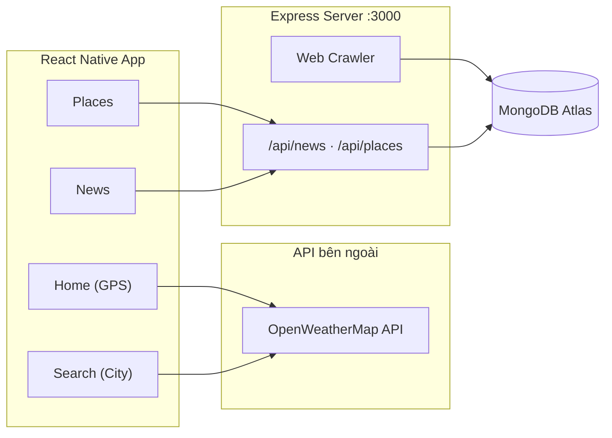

# WeatherApp

Ứng dụng di động thời tiết đa nền tảng được xây dựng bằng **React Native** và **TypeScript**. WeatherApp kết hợp dữ liệu thời tiết thời gian thực từ OpenWeatherMap với tin tức thời tiết và gợi ý địa điểm du lịch, mang đến trải nghiệm tra cứu thông tin thời tiết toàn diện trên một ứng dụng duy nhất.

**Tác giả:** [DangNghia17](https://github.com/DangNghia17) (_meaning17)

---

## Mục lục

- [Tính năng](#tính-năng)
- [Công nghệ sử dụng](#công-nghệ-sử-dụng)
- [Kiến trúc hệ thống](#kiến-trúc-hệ-thống)
- [Cấu trúc thư mục](#cấu-trúc-thư-mục)
- [Yêu cầu hệ thống](#yêu-cầu-hệ-thống)
- [Cài đặt](#cài-đặt)
- [Cấu hình môi trường](#cấu-hình-môi-trường)
- [Khởi chạy dự án](#khởi-chạy-dự-án)
- [Scripts có sẵn](#scripts-có-sẵn)
- [Xử lý sự cố](#xử-lý-sự-cố)
- [Đóng góp](#đóng-góp)
- [Giấy phép](#giấy-phép)

---

## Tính năng

| Màn hình | Mô tả |
|----------|-------|
| **Home** | Hiển thị thời tiết theo vị trí GPS hiện tại — nhiệt độ, độ ẩm, áp suất, tốc độ gió và mô tả thời tiết bằng tiếng Việt |
| **Search** | Tìm kiếm thời tiết theo tên thành phố với validation form (Unform + Yup) |
| **Places** | Danh sách tour/địa điểm du lịch được crawl từ Fiditour, hỗ trợ tìm kiếm theo tiêu đề |
| **News** | Tin tức dự báo thời tiết từ VOV, cập nhật qua backend crawler |
| **User** | Giao diện đăng nhập (UI demo) với liên kết tới repository GitHub |

**Tính năng bổ sung:**

- Chuyển đổi giao diện **Sáng / Tối** với lưu trữ tùy chọn qua AsyncStorage
- Icon thời tiết động theo mã điều kiện OpenWeatherMap
- Bottom tab navigation với icon tùy chỉnh
- Backend REST API tự động crawl và đồng bộ dữ liệu vào MongoDB

---

## Công nghệ sử dụng

### Mobile (React Native)

| Thư viện | Phiên bản | Vai trò |
|----------|-----------|---------|
| React | ^18.2.0 | UI framework |
| React Native | ^0.70.13 | Nền tảng di động |
| TypeScript | ^3.8.3 | Kiểu tĩnh |
| React Navigation | ^5.x | Điều hướng (Bottom Tabs) |
| styled-components | ^5.3.11 | Styling & theming |
| axios | ^0.21.1 | HTTP client |
| react-native-geolocation-service | ^5.3.1 | Định vị GPS |
| @unform/mobile + yup | ^2.1.6 / ^0.32.9 | Form & validation |
| react-native-dotenv | ^3.0.0 | Biến môi trường |

### Backend (`connectDB/`)

| Thư viện | Vai trò |
|----------|---------|
| Express | REST API server (port `3000`) |
| Mongoose | Kết nối MongoDB Atlas |
| Cheerio + axios | Web scraping (VOV, Fiditour) |
| cors | Cho phép truy cập cross-origin từ thiết bị di động |

### API bên ngoài

- **[OpenWeatherMap](https://openweathermap.org/api)** — Dữ liệu thời tiết thời gian thực
- **VOV.vn** — Nguồn tin tức thời tiết
- **Fiditour.com** — Nguồn dữ liệu địa điểm du lịch

---

## Kiến trúc hệ thống



**Luồng dữ liệu:**

1. Màn hình **Home** và **Search** gọi trực tiếp OpenWeatherMap bằng API key trong `.env`.
2. Màn hình **News** và **Places** gọi REST API nội bộ tại `src/services/constants.ts`.
3. Backend khởi động → crawl dữ liệu từ VOV & Fiditour → lưu vào MongoDB → phục vụ qua API.

---

## Cấu trúc thư mục

```
WeatherApp/
├── connectDB/                  # Backend Express + MongoDB + Crawler
│   ├── server.js               # REST API server (port 3000)
│   ├── db.js                   # Kết nối MongoDB & models
│   └── crawler.js              # Web scraping VOV & Fiditour
├── src/
│   ├── pages/
│   │   ├── Home/               # Thời tiết theo GPS
│   │   ├── Search/             # Tìm kiếm theo thành phố
│   │   ├── Places/             # Địa điểm du lịch
│   │   ├── New/                # Tin tức thời tiết
│   │   └── User/               # Giao diện người dùng
│   ├── components/             # Input, ThemeSwitcher, ...
│   ├── services/
│   │   ├── apiOpenweather.ts   # Client OpenWeatherMap
│   │   └── constants.ts        # Base URL REST API nội bộ
│   ├── hooks/                  # Theme provider (light/dark)
│   ├── routes/                 # Bottom tab navigator
│   ├── styles/themes/          # Bộ màu light & dark
│   ├── utils/                  # Helpers (weather icon, capitalize, ...)
│   └── types/                  # TypeScript interfaces
├── ios/                        # Native iOS project
├── .env                        # WEATHER_API_KEY
├── app.json
└── package.json
```

> **Lưu ý:** Thư mục `android/` được thêm vào `.gitignore`. Nếu chưa có, hãy tạo lại bằng lệnh `npx react-native eject` hoặc copy từ một dự án React Native 0.70 tương ứng.

---

## Yêu cầu hệ thống

| Công cụ | Phiên bản khuyến nghị |
|---------|----------------------|
| Node.js | v16.x |
| npm hoặc yarn | Mới nhất |
| JDK | 11 |
| Android SDK | API Level 32 |
| Gradle | 7.5.1 |
| Xcode | 14+ (chỉ cho iOS, trên macOS) |
| MongoDB Atlas | Cluster hoạt động (cho backend) |

**Tài khoản API cần có:**

- [OpenWeatherMap API Key](https://home.openweathermap.org/api_keys) (miễn phí)

---

## Cài đặt

### 1. Clone repository

```bash
git clone https://github.com/DangNghia17/weather-app-react-native.git
cd weather-app-react-native
```

### 2. Cài đặt dependencies

```bash
npm install
# hoặc
yarn install
```

### 3. Cài đặt pods (iOS — chỉ trên macOS)

```bash
cd ios && pod install && cd ..
```

---

## Cấu hình môi trường

### Biến môi trường (`.env`)

Tạo hoặc chỉnh sửa file `.env` tại thư mục gốc:

```env
WEATHER_API_KEY=your_openweathermap_api_key_here
```

> Không commit file `.env` chứa API key thật lên repository công khai.

### Cấu hình REST API nội bộ

File `src/services/constants.ts` chứa địa chỉ IP máy chạy backend. **Thiết bị di động/emulator phải truy cập được địa chỉ này.**

```typescript
export const baseApiUrl = 'http://<YOUR_IPV4>:3000/api';
```

**Cách lấy IPv4:**

| Hệ điều hành | Lệnh |
|--------------|------|
| Windows | `ipconfig` |
| macOS / Linux | `ifconfig` hoặc `ip addr` |

**Lưu ý quan trọng:**

- Giữ nguyên **port `3000`** — backend mặc định chạy trên port này.
- Nếu dùng **Android Emulator**, thay IPv4 bằng `10.0.2.2` (alias tới localhost của máy host).
- Đảm bảo điện thoại và máy tính **cùng mạng Wi-Fi** khi test trên thiết bị thật.

### Cấu hình MongoDB (Backend)

Chỉnh sửa chuỗi kết nối trong `connectDB/db.js` trỏ tới cluster MongoDB Atlas của bạn.

---

## Khởi chạy dự án

Dự án gồm **hai thành phần** cần chạy song song: Backend API và ứng dụng React Native.

### Bước 1 — Khởi động Backend

```bash
cd connectDB
node server.js
```

Khi khởi động thành công, server sẽ:

1. Lắng nghe tại `http://localhost:3000`
2. Tự động crawl tin tức từ VOV và địa điểm từ Fiditour
3. Lưu dữ liệu vào MongoDB

**Endpoints:**

| Method | Endpoint | Mô tả |
|--------|----------|-------|
| `GET` | `/api/news` | Danh sách tin tức thời tiết |
| `GET` | `/api/places` | Danh sách địa điểm du lịch |

### Bước 2 — Khởi động Metro Bundler

Mở terminal mới tại thư mục gốc:

```bash
npm start
```

### Bước 3 — Chạy ứng dụng

**Android:**

```bash
npm run android
# hoặc
npx react-native run-android
```

**iOS (macOS):**

```bash
npm run ios
# hoặc
npx react-native run-ios
```

### Kiểm tra trước khi chạy

- [ ] Backend đang chạy và đã crawl xong dữ liệu
- [ ] `WEATHER_API_KEY` trong `.env` hợp lệ
- [ ] `baseApiUrl` trong `constants.ts` trỏ đúng IP máy host
- [ ] Quyền **Location** đã được cấp (màn hình Home)
- [ ] Google Maps / dịch vụ định vị hoạt động bình thường trên thiết bị

---

## Scripts có sẵn

| Script | Lệnh | Mô tả |
|--------|------|-------|
| `start` | `npm start` | Khởi động Metro bundler |
| `android` | `npm run android` | Build & chạy trên Android |
| `ios` | `npm run ios` | Build & chạy trên iOS |
| `test` | `npm test` | Chạy unit tests (Jest) |
| `lint` | `npm run lint` | Kiểm tra code style (ESLint) |

---

## Xử lý sự cố

<details>
<summary><strong>API thời tiết không hoạt động</strong></summary>

- Kiểm tra `WEATHER_API_KEY` trong file `.env`
- Đảm bảo đã restart Metro bundler sau khi thay đổi `.env`
- Xác nhận kết nối internet trên thiết bị

</details>

<details>
<summary><strong>Màn hình News / Places trống hoặc lỗi</strong></summary>

- Xác nhận backend đang chạy: `node connectDB/server.js`
- Kiểm tra `baseApiUrl` trong `src/services/constants.ts` — IP phải đúng và port `3000`
- Với Android Emulator, dùng `http://10.0.2.2:3000/api`
- Kiểm tra MongoDB Atlas đã kết nối thành công trong log backend

</details>

<details>
<summary><strong>Không lấy được vị trí GPS (Home)</strong></summary>

- Cấp quyền Location cho ứng dụng trong Cài đặt thiết bị
- Bật GPS / Dịch vụ định vị
- Trên iOS: kiểm tra `Info.plist` đã khai báo `NSLocationWhenInUseUsageDescription`

</details>

<details>
<summary><strong>Lỗi build Android</strong></summary>

- Đảm bảo `android/` tồn tại (thư mục bị gitignore, cần tạo lại nếu thiếu)
- Kiểm tra Android SDK API Level 32 và Gradle 7.5.1
- Chạy `cd android && ./gradlew clean` rồi build lại

</details>

---

## Đóng góp

Mọi đóng góp đều được chào đón! Vui lòng:

1. Fork repository
2. Tạo branch mới (`git checkout -b feature/ten-tinh-nang`)
3. Commit thay đổi (`git commit -m 'feat: mô tả tính năng'`)
4. Push lên branch (`git push origin feature/ten-tinh-nang`)
5. Mở Pull Request

---

## Giấy phép

Dự án này được phát triển cho mục đích học tập và cá nhân bởi **DangNghia17**.

---

<p align="center">
  <strong>WeatherApp</strong> — Phiên bản 7.2.5<br/>
  Phát triển bởi <a href="https://github.com/DangNghia17">Nghia</a>
</p>
